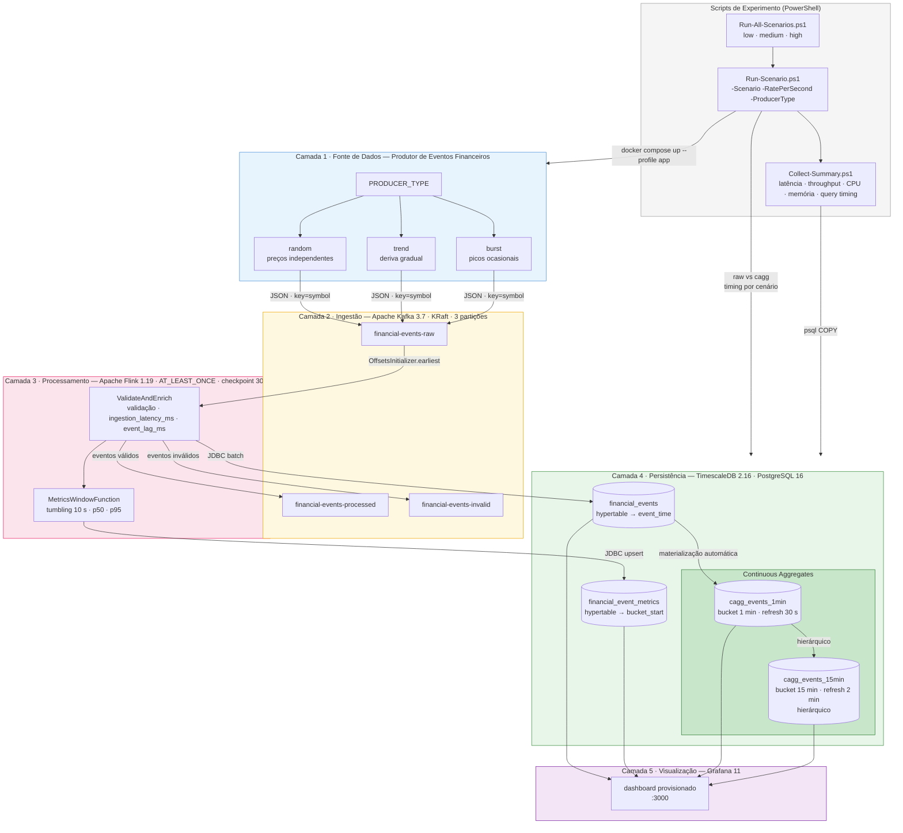

# Arquitetura da Pipeline

```mermaid
flowchart TD
    subgraph Scripts["Scripts de Experimento (PowerShell)"]
        S1["Run-All-Scenarios.ps1\nlow · medium · high"]
        S2["Run-Scenario.ps1\n-Scenario -RatePerSecond -ProducerType"]
        S3["Collect-Summary.ps1\nlatência · throughput · CPU · memória · query timing"]
        S1 --> S2 --> S3
    end

    subgraph L1["Camada 1 · Fonte de Dados — Produtor de Eventos Financeiros"]
        PT["PRODUCER_TYPE"]
        P1["random\npreços independentes"]
        P2["trend\nderiva gradual"]
        P3["burst\npicos ocasionais"]
        PT --> P1 & P2 & P3
    end

    subgraph L2["Camada 2 · Ingestão — Apache Kafka 3.7  ·  KRaft  ·  3 partições"]
        KR["financial-events-raw"]
        KP["financial-events-processed"]
        KI["financial-events-invalid"]
    end

    subgraph L3["Camada 3 · Processamento — Apache Flink 1.19  ·  AT_LEAST_ONCE  ·  checkpoint 30 s"]
        FV["ValidateAndEnrich\nvalidação · ingestion_latency_ms · event_lag_ms"]
        FW["MetricsWindowFunction\ntumbling 10 s · p50 · p95"]
        FV --> FW
    end

    subgraph L4["Camada 4 · Persistência — TimescaleDB 2.16  ·  PostgreSQL 16"]
        TE[("financial_events\nhypertable → event_time")]
        TM[("financial_event_metrics\nhypertable → bucket_start")]
        subgraph CAGG["Continuous Aggregates"]
            CA1[("cagg_events_1min\nbucket 1 min · refresh 30 s")]
            CA2[("cagg_events_15min\nbucket 15 min · refresh 2 min\nhierárquico")]
            CA1 -->|"hierárquico"| CA2
        end
        TE -->|"materialização automática"| CA1
    end

    subgraph L5["Camada 5 · Visualização — Grafana 11"]
        G["dashboard provisionado\n:3000"]
    end

    S2 -->|"docker compose up --profile app"| L1
    P1 & P2 & P3 -->|"JSON · key=symbol"| KR
    KR -->|"OffsetsInitializer.earliest"| FV
    FV -->|"eventos válidos"| KP
    FV -->|"eventos inválidos"| KI
    FV -->|"JDBC batch"| TE
    FW -->|"JDBC upsert"| TM
    TE & TM & CA1 & CA2 --> G
    S2 -->|"raw vs cagg\ntiming por cenário"| L4
    S3 -->|"psql COPY"| L4

    style Scripts fill:#f5f5f5,stroke:#999
    style L1 fill:#e8f4fd,stroke:#4a90d9
    style L2 fill:#fff8e1,stroke:#f0a500
    style L3 fill:#fce4ec,stroke:#e91e63
    style L4 fill:#e8f5e9,stroke:#388e3c
    style CAGG fill:#c8e6c9,stroke:#2e7d32
    style L5 fill:#f3e5f5,stroke:#7b1fa2
```
